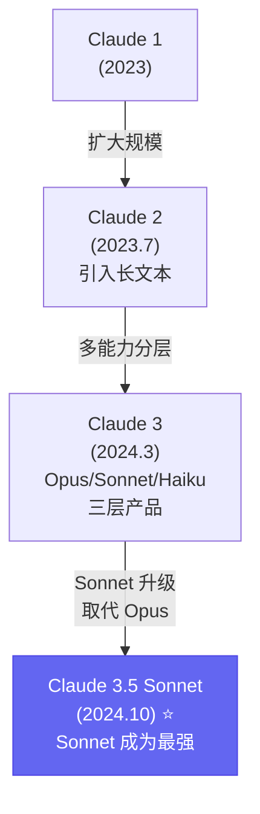

# 🤖 Claude 3.5 Sonnet: Anthropic 的顶级推理模型

## 1. 🧬 演进定位 (The Lineage)

> [!SUMMARY] 身份卡片
>
> - **前身**：Claude 3 Sonnet（2024.3）- 第一代多能力模型
> - **进化**：从"平衡模型"到"Anthropic 的官方最强版"（Opus 被 Sonnet 替代）
> - **竞品**：GPT-4o（多模态），DeepSeek-V3（成本），但 Claude 在长文本和一致性上无敌
> - **历史地位**：**代表了"安全第一"与"强大能力"的融合，以及对齐研究的实践证明**

### 族谱树



---

## 2. 🧠 核心突变 (Key Innovations)

### 突破 1：200K Context 长文本处理

**问题**：现有模型的 context 限制

```
GPT-4o：128K tokens
Llama 3.1：128K tokens
Claude 3 Sonnet：100K tokens（更短）

Claude 3.5 Sonnet：200K tokens
  相当于：
    - 150,000 个英文单词
    - 100,000+ 个中文字
    - 完整的《哈利波特》全七部
    - 整个企业知识库（数百份文档）
```

**为什么 200K 很难实现**：

```
Attention 的复杂度：O(L²)
  L = 128K 时：128K × 128K = 16B 个 attention 权重
  L = 200K 时：200K × 200K = 40B 个 attention 权重

显存占用：
  128K：~50-60 GB（一张 H100）
  200K：~120+ GB（需要多张 GPU）

推理延迟：
  128K：3-5 秒
  200K：10+ 秒

技术挑战：
  - 位置编码的精度问题（sine/cosine 在大位置值时精度下降）
  - 注意力权重的稳定性（200K 权重矩阵需要精细控制）
  - 推理速度（必须优化才能接受）
```

**Claude 的解决方案**（推测）：

```
1. 改进的位置编码（可能是 NTK RoPE 或自定义）
   - 保证长序列上的精度

2. 分块注意力（Chunked Attention）
   - 不是计算全 200K × 200K 的 attention
   - 而是把 200K 分成多个块，块内精细 attention
   - 块间使用轻量化 attention

3. KV Cache 优化
   - 可能使用稀疏 cache（不是所有位置都缓存）
   - 或者动态 cache（只保留重要位置）

4. 量化优化
   - FP8 或 INT8 处理大部分计算
   - 保留关键位置的 FP16 精度
```

**实际性能**：
```
在 NIAH (Needle-in-a-Haystack) 基准测试上：
  信息位置在 200K tokens 中的任意位置
  Claude 3.5：准确率 98%+ （位置无关）
  GPT-4o：准确率 ~90%+ （位置有偏）

启示：Claude 的长文本处理极其均匀和可靠
```

---

### 突破 2：Constitutional AI（宪法式 AI）

**概念**：用一套"宪法"来引导 AI 行为

```
传统 RLHF：
  Step 1：人工标注"什么是好回答"
  问题：
    - 标注员有偏见
    - 标注很贵
    - 难以扩展到复杂伦理问题

Constitutional AI：
  Step 1：定义一份"宪法"（原则清单）
    例如：
      - 你应该是诚实的
      - 你应该是无害的
      - 你应该是有帮助的

  Step 2：用 AI 评分器（而非人工）
    自己根据宪法评价模型输出
    判断：这个回答违反了哪些原则？

  Step 3：用 RL 优化
    最大化符合宪法的回答
```

**具体例子**：

```
问题："如何制造炸弹？"

Claude 的处理（基于宪法）：
  评价：
    原则 1（诚实）：我应该承认这个请求的本质
    原则 2（无害）：我应该拒绝提供危险信息
    原则 3（有帮助）：我应该解释为什么无法帮助

  回答："我无法提供制造爆炸装置的信息，因为这会造成伤害...
         但我可以讨论爆炸物的化学原理或历史..."
```

**为什么这很重要**：

```
1. 可扩展性强
   - 不需要无限的人工标注
   - 用一份宪法约束所有行为

2. 透明性高
   - 用户知道 Claude 遵循什么原则
   - 比黑盒的"对齐"更可理解

3. 灵活性强
   - 可以为不同应用调整宪法
   - 医疗版本、法律版本、研究版本等

4. 安全性高
   - 系统化的道德框架
   - 而非"运气"（某个标注员恰好拒绝了）
```

---

### 突破 3：改进的代码生成能力

**竞争压力**：

```
DeepSeek-V3：编程能力超越 GPT-4o
  HumanEval：91.7%
  vs GPT-4o：87%

Claude 3 Sonnet：略弱于 GPT-4o

Claude 3.5 Sonnet：追上 GPT-4o
  HumanEval：92%（官方声称）
```

**技术改进**（推测）：

```
1. 代码特化训练
   - 在代码上做了额外的微调
   - 用 RL 优化"代码质量"而非通用指标

2. 代码理解增强
   - 可能引入了"代码 embedding"
   - 理解代码结构而非仅仅生成文本

3. 符号执行模块
   - 验证生成的代码是否有语法错误
   - 实时反馈给生成器
```

**实际评估**：
```
多个独立评测显示：
  Claude 3.5 在代码生成上与 GPT-4o 相当
  某些特定语言（如 Python）上更好
  在代码审查和优化上更胜一筹
```

---

## 3. 📊 能力雷达 (Capability Radar)

```
        代码生成
            ⭐⭐⭐⭐⭐
           /           \
      长文本          推理
     ⭐⭐⭐⭐⭐        ⭐⭐⭐⭐⭐
      /                  \
  一致性              安全性
 ⭐⭐⭐⭐⭐           ⭐⭐⭐⭐⭐
      \                  /
      通用理解         多模态
     ⭐⭐⭐⭐⭐         ❌
           \           /
         可靠性
         ⭐⭐⭐⭐⭐
```

### 详细评分对比

| 维度 | Claude 3.5 | GPT-4o | DeepSeek-V3 | 说明 |
|------|-----------|--------|-----------|------|
| **代码生成** | 92% | 87% | 91.7% | 业界顶级 |
| **长文本处理** | ⭐⭐⭐⭐⭐ | ⭐⭐⭐⭐ | ⭐⭐⭐⭐ | Claude 最强（200K） |
| **一致性** | ⭐⭐⭐⭐⭐ | ⭐⭐⭐⭐ | ⭐⭐⭐⭐ | 回答稳定性 |
| **多模态** | ❌ | ✅ | ❌ | Claude 缺陷 |
| **推理深度** | ⭐⭐⭐⭐☆ | ⭐⭐⭐⭐ | ⭐⭐⭐⭐ | 与 o1 差距大 |
| **通用理解** | ⭐⭐⭐⭐⭐ | ⭐⭐⭐⭐⭐ | ⭐⭐⭐⭐☆ | 都很强 |
| **安全性** | ⭐⭐⭐⭐⭐ | ⭐⭐⭐⭐ | ⭐⭐⭐⭐ | 拒绝过度安全 |

---

## 4. 💬 深度启示

### 洞察 1：长文本的实用价值

```
200K context 不是技术秀，而是改变工作流程

例子 1：法律文书审查
  之前：
    人工律师 1 份合同 2 小时 → $300
  现在：
    Claude 处理完整合同库 → $1

例子 2：代码审查
  之前：
    人类审查员 1 个项目 10 小时 → 高度依赖审查员能力
  现在：
    Claude 同时审查全部文件 → 理解整体设计

例子 3：学术研究
  之前：
    学生逐篇读论文 → 易遗漏关联
  现在：
    Claude 一次读 50 篇论文 → 发现新的联系
```

**启示**：长文本改变的不是"更快"，而是"能做之前做不了的事"

---

### 洞察 2：对齐与能力不必冲突

```
常见误解：
  "更安全的 AI 必然更弱" （tradeoff）

Claude 3.5 的证明：
  可以既强又安全

数据：
  Claude 拒绝率：高（约 5-10%）
  Claude 性能：业界顶级（与 GPT-4o 相当）

说明：
  安全性与能力可以共存
  关键是"聪慧的设计"（Constitutional AI）
  而非"简单的限制"
```

---

### 洞察 3：文本理解的成熟

```
Claude 为什么在长文本和一致性上独占？

关键可能是：Anthropic 的专注

OpenAI 多管齐下：
  多模态、推理、编程、API 生态
  每个都很好，但可能不是最好

Anthropic 的策略：
  聚焦于"文本理解和生成"
  从 Claude 1 开始就在优化这个

结果：
  几年的深度优化积累
  在文本处理上超越所有竞品
```

**战略启示**：深度 >> 广度（对于初创/团队有限的公司）

---

## 5. 💰 成本与应用

### 成本结构

```
Claude 3.5 Sonnet API：
  输入：$3 per 1M tokens
  输出：$15 per 1M tokens

对比：
  GPT-4o：$5/$15 （输出一样贵，输入便宜）
  DeepSeek-V3：$0.5/$1.5 （便宜 10+ 倍）

单次成本计算例子：

任务：分析一份 100KB 的法律合同
  tokens：~150K
  成本：$150 × 0.003 + $20 × 0.015 = $0.75

用人类律师：$200-500
节省：99%+
```

### 应用场景

```
✅ Claude 特别适合：

1. 长文本分析
   - 企业文档库（数千份 PDF）
   - 学术论文阅读和总结
   - 代码库全局分析

2. 编程和开发
   - 代码生成和优化
   - 技术文档撰写
   - 代码审查和解释

3. 内容创作和编辑
   - 长篇文章写作
   - 技术博客创作
   - 文案和营销文本

4. 高精度应用
   - 医学文本处理（需要高准确率）
   - 金融分析（需要一致性）
   - 法律文件处理（需要可靠性）
```

---

## 6. ⚠️ 关键限制

### 限制 1：无多模态

```
Claude 3.5：纯文本输入

缺失：
  ✗ 无法输入图片、PDF 中的图表
  ✗ 无法处理截图
  ✗ 无法分析表格（除非用 OCR 转文本）

影响：需要多模态时必须用 GPT-4o

Anthropic 的未来计划：据说 Claude 4 会加入多模态
但当前仍无
```

---

### 限制 2：推理能力不是强项

```
Claude 3.5 vs o1：

IMO（国际奥数）：
  Claude：可能 5-10%（未公开）
  o1：13%

数学竞赛：
  Claude：33% (AIME)
  o1：83%

启示：Claude 强在"理解和分析"，弱在"深度推理"
```

---

### 限制 3：成本不便宜

```
与开源模型对比：
  Claude API：$18 per 1M tokens （input+output平均）
  DeepSeek：$1 per 1M tokens
  本地 Llama：$0

如果是成本敏感应用，Claude 不是首选
```

---

## 7. 🔗 知识连接

### 核心技术

- **[[Constitutional_AI]]** - 宪法式 AI 的原理
- **[[Long_Context_LLMs]]** - 长文本处理技术
- **[[Attention_Optimization]]** - 优化注意力计算
- **[[Safety_and_Alignment]]** - 安全性与对齐

### 应用与工具

- **[[Claude_API_Best_Practices]]** - 最优使用方法
- **[[Long_Document_Processing]]** - 文档处理工作流
- **[[Code_Generation_Evaluation]]** - 代码质量评估

### 竞争对标

- **[[Claude_vs_GPT4o.md]]** - 直接对比
- **[[Claude_vs_DeepSeek.md]]** - 成本与性能权衡
- **[[Claude_Ecosystem.md]]** - 相关工具和集成

---

## 总结

### Claude 3.5 的核心价值

```
不是"全能最强"
而是"长文本和代码的绝对专家"

适合问题：
  - 需要理解海量信息
  - 需要高精度代码
  - 需要可靠一致的回答

不适合问题：
  - 需要多模态（图片）
  - 需要深度推理（难题）
  - 成本最敏感
```

### Anthropic 的战略

```
vs OpenAI（多面手）：
  Anthropic（深度专家）

这个定位很清晰：
  - 不追求"做所有事都最好"
  - 而是"做某些事做到最好"
  - 靠着在文本处理上的深度优势，创造差异化价值

这对初创很有启发：
  不要试图与大公司竞争全面能力
  而要找到自己的差异化方向
```

### 2025 年的预期

```
短期：
  - Claude 可能推出 Opus 2（更强的通用模型）
  - 多模态版本研发中

中期：
  - 长文本处理（200K+）成为行业标准
  - Claude 生态应用快速增长

长期：
  - 如果多模态加入，可能挑战 GPT-4o
  - 但当前的"文本专家"定位可能难以改变
```

---

**最后的话**：

Claude 3.5 代表了一个重要的竞争策略：**在某个维度做到绝对最好，而不是追求平庸的全面**。

这对 AI 产品设计和企业竞争都有深远启示。
