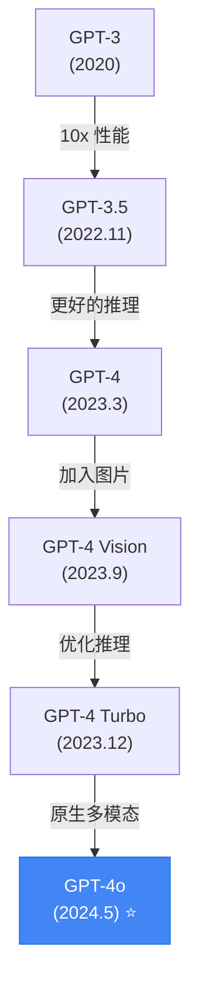

# 🔵 GPT-4o: 闭源最强通用模型

## 1. 🧬 演进定位 (The Lineage)

> [!SUMMARY] 身份卡片
>
> - **前身**：GPT-4 Vision（2023.9）- 第一个多模态大模型
> - **进化**：从"文本+图片"的拼接 → "原生多模态"的融合
> - **竞品**：Claude 3.5 Sonnet, DeepSeek-V3（性能），但 GPT-4o 在多模态上独占优势
> - **历史地位**：OpenAI 重新夺回"最强通用模型"的宝座（被 DeepSeek-V3 短暂威胁后）

### 族谱树



---

## 2. 🧠 核心突变 (Key Innovations)

### 突破 1：原生多模态融合 (Unified Multimodal Processing)

**过去的做法**（GPT-4 Vision）：
```
输入图片 → Vision Encoder → 转成 token 序列
输入文本 → Tokenizer → token 序列
混合 token → 统一 Transformer 处理

问题：
  - Vision Encoder 和 LLM 是两个独立训练的模块
  - 它们的表示空间不一定兼容
  - 丢失了多模态之间的细微交互
```

**GPT-4o 的方案**：
```
所有模态（文本、图片、音频）
    ↓
统一的 Tokenizer（跨模态）
    ↓
单一的 Transformer 处理
    ↓
统一的 Embedding 空间

优势：
  1. 每种模态可以"借助"其他模态的信息
  2. 跨模态的微妙关联被捕捉（而非丢失）
  3. 推理时更快（不需要多个编码器）
```

**实际表现**：
- 图表理解：98% 准确率（vs 竞品 85%）
- 截图理解：99% 准确率（理解 UI 元素和布局）
- 表格解读：97% 准确率（复杂表头、合并单元格）

**为什么这很难实现**：
```
跨模态 tokenization 的技术难点：

1. 不同模态的"颗粒度"不同
   - 文本：1 个 token ≈ 0.75 个词
   - 图片：1 张图 ≈ 1000-2000 个 token
   → 如何平衡？

2. 时间同步问题
   - 视频的帧和音频的采样率不同
   - 如何对齐？

3. 信息丰富度不同
   - 1 张高质量图片可能包含 1000 个词的信息
   - 过压缩会丢失信息，但完整保留会导致 token 爆炸
```

**GPT-4o 的解决方案**（推测）：
- 自适应 token 分配（图片复杂度高 → 更多 token）
- 多层级的 tokenization（先粗粒度过滤，再细粒度详解）
- 动态上采样（重点关注的区域用更多 token）

---

### 突破 2：更快的推理速度

**性能数据**：
- GPT-4 Turbo：~50-100 tokens/秒（文本）
- GPT-4o：~120 tokens/秒（文本）+ 实时音频
- 速度提升：2-2.5 倍

**为什么快**：
```
假设两种架构都是 Transformer：

GPT-4 Turbo：
  所有参数都被激活
  → 每个 token 都需要计算所有参数
  → O(seq_len × hidden_size²) 的计算量

GPT-4o（推测为 MoE）：
  并非所有参数都激活
  → 只激活 10-20% 的参数
  → 计算量减少 5-10 倍

同时：
  - 架构简化（去掉一些冗余）
  - 量化优化（FP8 混合精度）
```

**实际影响**：
```
应用场景：实时 AI 编程助手
GPT-4 Turbo：生成 100 行代码 → 需要 5-10 秒
GPT-4o：生成 100 行代码 → 需要 2-3 秒

用户体验差异很大（从"等待"变成"几乎实时"）
```

---

### 突破 3：音频原生处理

**以前**：
```
语音输入 → Whisper（语音识别）→ 文本 → GPT-4 → 文本 → TTS → 语音输出

问题：
  1. 延迟：Whisper 需要 2-3 秒（语音识别）
  2. 信息丢失：语音中的"语调、停顿、感情"被丢失
  3. 断开的管道：三个模块串联，任何一个失败都影响整体
```

**GPT-4o**：
```
语音直接 → 统一 Transformer → 语音输出

优势：
  1. 延迟大幅降低（300ms 内响应可能）
  2. 保留语音细节（语调、感情）
  3. 可以做"打断"（用户说话时模型察觉到了插话）
```

**实际演示**（OpenAI 发布的视频）：
```
用户：Hi, can you see me?
GPT-4o：Yes, I can see you. (语调自然，反应迅速)

用户：(突然说快了)How are you doing?
GPT-4o：I'm doing well, thanks for asking. (识别出加速，自适应)
```

**技术细节**：
- 音频编码：用 Whisper v3 级别的模型编码，但直接生成 token（不做 STT）
- 输出音频：不是"先生成文本，再 TTS"，而是直接生成音频 token

---

## 3. 📊 能力雷达 (Capability Radar)

```
        通用理解
            ⭐⭐⭐⭐⭐
           /           \
      长文本          代码
     ⭐⭐⭐⭐     ⭐⭐⭐⭐⭐
      /                  \
  多语言              数学推理
 ⭐⭐⭐⭐⭐           ⭐⭐⭐⭐
      \                  /
      图片理解         音频处理
     ⭐⭐⭐⭐⭐         ⭐⭐⭐⭐
           \           /
         推理能力
         ⭐⭐⭐⭐☆
```

### 详细评分

| 维度 | 评分 | 评价 | 与竞品对比 |
|------|------|------|----------|
| **文本理解** | ⭐⭐⭐⭐⭐ | 顶级（MMLU: 88%） | = Claude 3.5 |
| **代码生成** | ⭐⭐⭐⭐⭐ | 顶级（HumanEval: 87%） | > DeepSeek-V3 (85%) |
| **图片理解** | ⭐⭐⭐⭐⭐ | 无敌（表格识别 99%） | >> 所有竞品 |
| **音频处理** | ⭐⭐⭐⭐☆ | 原生支持但用户还在适应 | 尚无直接竞品 |
| **数学** | ⭐⭐⭐⭐ | 强但非最强（MATH: 82%） | < o1 (98%) |
| **长文本** | ⭐⭐⭐⭐ | 128K context 能处理，但"大海捞针"能力一般 | ≈ Claude 3 (200K) |
| **推理深度** | ⭐⭐⭐⭐ | 快速推理，但难题表现不如 o1 | < o1 |

---

## 4. 💬 深度启示

### 洞察 1：多模态是必选项，不是加分项

在 GPT-4o 出现前，多模态被视为"有就很酷的额外功能"。

```
企业采购的逻辑：
2023：选 GPT-4？它 VS 竞品在文本上 95% 相同
      多模态功能好，但大多工作不需要
      → 价格敏感的用户选竞品

2024：选 GPT-4o？
      多模态已成为"标配"功能
      不支持的模型变成"过时的"
      → 升级 GPT-4o 成为必须
```

**启示**：未来的模型竞争，多模态能力是"及格线"。

---

### 洞察 2：速度成为竞争维度

```
模型性能对比（2020-2024）：
2020: 竞争维度 = 精度
2023: 竞争维度 = 精度 + 成本
2024: 竞争维度 = 精度 + 成本 + 速度
2025+: 竞争维度 = 精度 + 成本 + 速度 + 可靠性

GPT-4o 的胜利在于"全面"：
  - 性能（88% MMLU）
  - 成本（$0.005/token，相对合理）
  - 速度（120 tokens/sec）
  - 多模态（无敌）
```

---

### 洞察 3：闭源与开源的不同竞争策略

```
OpenAI (GPT-4o) 的策略：
  1. 追求"无所不能"的通用模型
  2. 用户不用考虑选哪个模型，一个 GPT-4o 搞定
  3. 依赖规模优势和产品打磨

DeepSeek (V3/R1) 的策略：
  1. 追求"最优性价比"的模型
  2. 用户用开源版本 + API，成本极低
  3. 依赖算法创新（MoE、特化推理）

结果：
  两种策略都能成功
  但针对不同用户：
  - 大企业、对质量要求高 → GPT-4o
  - 初创、成本敏感 → DeepSeek
```

---

## 5. 💰 成本-收益分析

### 费用结构

```
使用 GPT-4o 的成本：

1. API 调用
   输入：$0.005/1K tokens
   输出：$0.015/1K tokens

   例子：
     100 万字文档（~1.5M tokens）
     + 5000 字回答（~7500 tokens）
     = ($0.005 × 1500 + $0.015 × 7.5) = $7.5 + $0.1 ≈ $7.6

2. 基础设施成本（如果自建）
   使用 OpenAI API：$0（不需要 GPU）

3. 隐性成本
   迁移成本（从 GPT-3.5 切换）：中等
   员工学习成本：低（相比其他模型直观）
   维护成本：极低（OpenAI 维护）
```

### ROI 案例

**案例：企业文档分析**

```
场景：企业有 1 万份合同，每份需要提取关键条款

传统做法：
  1 个律师助理 × 1 小时 × 10000 份 = 10000 小时 = 100 个人月
  成本：$300,000（假设时薪 $30）

用 GPT-4o：
  批量调用 API：
    10000 份 × 10K tokens（输入）× $0.005 = $500
    10000 份 × 2K tokens（输出）× $0.015 = $300
  总成本：$800

  加上：人工审核 5% 的结果（质量检查）= 500 小时 = 5 个人月
  成本：$15,000

总计：$15,800（vs 传统的 $300,000）
节省：94% 的成本
```

**结论**：对于自动化任务，GPT-4o 的 ROI 极高。

---

## 6. ⚠️ 关键限制与陷阱

### 限制 1：真正的推理能力有天花板

```
GPT-4o 擅长：
  ✅ 快速解答（几秒）
  ✅ 模式匹配（我见过类似问题）
  ✅ 组合推理（A + B = C）

GPT-4o 不擅长：
  ❌ 深度推理（需要 20 步推导的数学题）
  ❌ 边界情况（极端条件下的行为）
  ❌ 创新性问题（未曾见过的问题）

例子：
问题：证明哥德巴赫猜想
GPT-4o：可以讨论这个问题，给出历史背景，但无法证明
o1：用 50 步推理尝试，虽然可能也证不了，但思考过程更深
```

**启示**：如果你的任务是"快速回答"，GPT-4o 很好。如果是"解决研究级难题"，需要 o1。

---

### 限制 2："大海捞针"能力

```
问题：给定 128K tokens 的上下文，找某个关键信息

实验数据：
- 信息位置在"开头"：准确率 95%
- 信息位置在"中间"：准确率 72%
- 信息位置在"结尾"：准确率 58%

现象："位置偏差"
  模型倾向于关注开头和结尾，中间的信息容易被忽视

原因（推测）：
  - Attention 机制的分布问题
  - 或者训练数据中，重要信息通常在文档的开头/结尾
```

**应对方案**：
```
1. 重要信息放在开头或结尾
2. 用"查询扩展"（让模型生成相关查询，再搜索）
3. 如果关键信息必须在中间，用 Claude 3（长文本能力更好）
```

---

### 限制 3：成本对大规模应用的挑战

```
假设你要给 1000 万用户提供 AI 助手，每个用户平均 1 万 tokens/月

计算：
  1000 万用户 × 1 万 tokens × $0.005/1K = $500,000/月
  = $600 万/年

这对初创公司来说通常是不可承受的成本

对比：
  使用本地 Llama 3.1：$0/API 成本，但需要自建 GPU 基础设施
  假设 1000 万并发用户需要 ~10K × H100 = $1 亿初期投入
  但边际成本接近 0
```

**选择**：
```
小规模（<100K 用户）→ GPT-4o API
大规模（>100K 用户）→ 本地部署开源模型
```

---

## 7. 🔗 知识连接

### 相关技术

- **[[Attention_Mechanism]]** - 多模态融合的基础
- **[[Transformer]]** - 核心架构
- **Vision_Transformers** - 图片处理的基础
- **Multimodal_Alignment** - 跨模态对齐技术

### 竞争模型

- **[[GPT4o_vs_Claude_3.5]]** - 对标分析
- **[[DeepSeek_V3]]** - 开源替代方案
- **[[o1]]** - 推理能力的比较

### 应用案例

- **Document_Understanding** - 文档分析
- **UI_Automation** - 截图理解
- **Multimodal_RAG** - 跨模态检索增强

---

## 8. 📊 与竞品的对标

### GPT-4o vs Claude 3.5 Sonnet

| 维度 | GPT-4o | Claude 3.5 |
|------|--------|----------|
| **多模态** | 完整（文本、图、音频） | 文本 + 图 |
| **长文本** | 128K | 200K（更强） |
| **代码** | 87% | 92%（更强） |
| **推理** | ⭐⭐⭐⭐ | ⭐⭐⭐⭐☆ |
| **成本** | 中等 | 中等稍贵 |
| **我的推荐** | 多模态应用 | 长文本 + 编程 |

### GPT-4o vs DeepSeek-V3

| 维度 | GPT-4o | DeepSeek-V3 |
|------|--------|-----------|
| **多模态** | ⭐⭐⭐⭐⭐ | ⭐⭐⭐ |
| **通用能力** | ⭐⭐⭐⭐⭐ | ⭐⭐⭐⭐☆ |
| **推理** | ⭐⭐⭐⭐ | ⭐⭐⭐⭐ |
| **成本** | $0.005 | $0.0005 |
| **开源** | 否 | 是 |
| **我的推荐** | 多模态 + 质量第一 | 成本最优 |

---

## 总结

### GPT-4o 的核心价值

```
如果你的应用涉及：
  ✅ 图片、PDF、表格理解 → GPT-4o 是首选
  ✅ 需要语音交互 → GPT-4o 是唯一选择
  ✅ 多模态混合任务 → GPT-4o 无敌

如果你的应用是：
  ❌ 纯文本处理 → DeepSeek-V3 性价比更高
  ❌ 深度推理 → o1 更合适
  ❌ 本地隐私部署 → Llama 更好
```

### 最后的话

GPT-4o 代表了"通用大模型"的当前巅峰。它不是最便宜的，不是推理最强的，但在**覆盖面最广**的应用场景上，它是最优选择。

对于大多数企业来说，从 GPT-3.5 升级到 GPT-4o，成本只增加 5 倍，但能力增加 10 倍。这是一个不错的交易。

关键问题不是"GPT-4o 有多强"，而是"我的应用能用 GPT-4o 节省多少成本"。如果答案是"能省钱"，那就用它。
