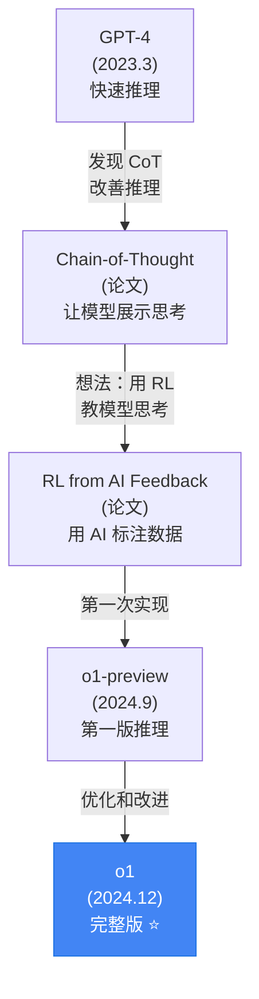

# 🧠 o1: 推理能力的范式突破

## 1. 🧬 演进定位 (The Lineage)

> [!SUMMARY] 身份卡片
>
> - **前身**：GPT-4（2023.3）- 能回答各种问题，但思考深度有限
> - **进化**：从"快速回答"到"深度思考"，引入"测试时计算"这个全新维度
> - **竞品**：DeepSeek-R1（开源推理模型，尝试复现 o1 能力），但性能略低
> - **历史地位**：**标志着 LLM 范式从"Scaling Laws"转向"Inference-Time Compute"**

### 族谱树



---

## 2. 🧠 核心突变 (Key Innovations)

### 突破 1：测试时计算 (Test-Time Compute)

这是 o1 最根本的创新。

#### 传统模型的推理流程

```
GPT-4：
  Input: "求 π 的前 100 位数字"

  处理：
    token_1: "求"        ← 模型快速处理
    token_2: "π"
    token_3: "的"
    ...
    token_50: "3.14159..."

  特点：
    - 推理步数 = 输出 token 数
    - 如果需要 100 步推理，但问题只输出 20 token
    - → 推理深度被限制在 20 步
```

#### o1 的推理流程

```
o1：
  Input: "求 π 的前 100 位数字"

  处理：
    思考阶段（不显示）：
      step_1: 这需要用什么方法？→ Bailey–Borwein–Plouffe 公式
      step_2: 如何计算第 1-25 位？
      step_3: 验证第 1-25 位是否正确
      step_4: 如何计算第 26-50 位？
      ...
      step_100: 最终验证整个 100 位

    输出阶段（显示）：
      "π 的前 100 位是：3.14159265... [完整答案]"

  特点：
    - 思考步数 >> 输出 token 数
    - 可以花 100 步推导来回答一个简单问题
    - 推理深度由"问题难度"而非"输出长度"决定
```

#### 数学表示

**传统模型**：
$$P(y|x) = \prod_{t=1}^{T} P(y_t | y_{<t}, x)$$

其中每个 $y_t$ 都对应一个推理步骤。推理深度 ≈ $T$。

**o1 模型**：
$$P(y|x) = P(y | \text{thinking}(x, k))$$

其中：
- $\text{thinking}(x, k)$ 是 $k$ 步的内部推理过程
- $k$ 可以很大（50-200 步），而最终 $|y|$ 很小
- 推理深度 ≈ $k$，不受输出长度限制

#### 实现细节

1. **思考 Token** 的引入：
```
o1 的实际生成：
  <thinking>
    step_1: 我需要计算...
    step_2: 使用方法...
    step_3: 验证...
  </thinking>

  最终答案：3.14159265...

其中 <thinking> ... </thinking> 内的 token 对用户隐藏
```

2. **强化学习** 来优化推理过程：
```
训练数据：
  难题 + 正确答案

标注过程：
  Step 1: 模型生成推理链（100 步）
  Step 2: 检查最终答案是否正确
  Step 3: 用 RL 奖励"推理正确"的路径

结果：模型学会自己探索正确的推理链
```

---

### 突破 2：自验证机制 (Self-Verification)

#### 问题：模型会犯错

```
即使有深度推理，模型仍然会犯错。例如：

问题：12345 × 67890 = ?
正确答案：838,102,050

o1 的推理：
  step_1: 我会分步计算
  step_2: 12345 × 60000 = 740,700,000
  step_3: 12345 × 7000 = 86,415,000
  step_4: 12345 × 890 = 10,987,050
  step_5: 740,700,000 + 86,415,000 + 10,987,050 = 838,102,050 ✓

但如果出现错误：
  step_2: 12345 × 60000 = 740,600,000 ✗ (算错了)
  ...
  step_5: 最终答案 = 错误值
```

#### 解决方案：嵌入验证

```
o1 的改进：

step_1-4: 计算过程
step_5-8: 验证过程
  - 用不同方法重新计算（"验证计算"）
  - 检查中间步骤是否一致（"一致性检查"）
  - 特殊值测试（"边界情况"）

最后：
  如果验证失败 → 重新思考
  如果验证通过 → 输出答案
```

#### 数学形式

```
单回合验证：
  Answer = Thinking(x)
  Correct = Verify(Answer, x)
  if not Correct:
    Answer = Thinking(x) × 重新尝试

多回合验证（推测）：
  思考链中多个位置都有验证检查点
  错误的分支被剪枝
```

---

### 突破 3：强化学习的全新应用

#### 传统 RL 用于 LLM

```
旧方法（RLHF）：
  Step 1: 用 SFT 在高质量数据上微调
  Step 2: 收集模型生成的多个答案
  Step 3: 人工标注"哪个答案更好"
  Step 4: 训练"奖励模型"学会评分
  Step 5: 用 PPO 优化模型以最大化奖励

问题：
  人工标注非常贵（即使是简单的 ranking 任务）
  难以扩展到复杂推理（谁来验证数学证明？）
```

#### o1 的新方法

```
新方法（AI feedback RL）：
  Step 1: 用 SFT 微调（基础）
  Step 2: 模型生成推理链 + 答案
  Step 3: 用"验证器"（可能是 symbolic 检查）自动验证
         对于数学：用计算机代数系统验证
         对于编程：运行代码，检查是否通过 test cases
  Step 4: RL：最大化"正确答案的概率"

好处：
  - 不需要人工标注（自动验证）
  - 可以大规模运行
  - 对齐与性能同时提升
```

#### 实际影响

```
这意味着：
  ✓ 不需要百万人工标注者
  ✓ 可以用廉价的计算替代昂贵的人工
  ✓ 推理能力可以持续改善（更多 RL 数据）

这是一个深刻的范式转变：
  从"依赖人工智慧的标注"
  到"依赖符号验证的自动反馈"
```

---

## 3. 📊 能力雷达 (Capability Radar)

```
        数学竞赛
            ⭐⭐⭐⭐⭐
           /           \
      物理            编程竞赛
     ⭐⭐⭐⭐⭐        ⭐⭐⭐⭐⭐
      /                  \
  科学推理            逻辑证明
 ⭐⭐⭐⭐⭐          ⭐⭐⭐⭐⭐
      \                  /
      一般问答          常识推理
     ⭐⭐⭐⭐          ⭐⭐⭐⭐
           \           /
         推理深度
         ⭐⭐⭐⭐⭐
```

### 详细评分

| 任务 | o1 | GPT-4o | DeepSeek-V3 | 说明 |
|------|-----|--------|-----------|------|
| **AIME (美国数学)** | 83% | 9% | 79% | 这是 o1 最强的地方 |
| **IMO (国际奥数)** | 13% | 2% | 未测 | 难到人类也难以解决 |
| **代码竞赛** | 89% (AtCoder) | 11% | 71% | o1 是顶尖程序员水平 |
| **通用理解** | ⭐⭐⭐⭐☆ | ⭐⭐⭐⭐⭐ | ⭐⭐⭐⭐☆ | 不是 o1 的强项 |
| **多模态** | ❌ | ✅ | ❌ | o1 没有多模态 |
| **长文本** | ⭐⭐⭐⭐ | ⭐⭐⭐⭐☆ | ⭐⭐⭐⭐ | 推理中忽视冗长信息 |

---

## 4. 💬 深度启示

### 洞察 1：推理能力的"忽然突破"

```
推理能力曲线：

GPT-3.5: AIME 0%
GPT-4:   AIME 9%
GPT-4o:  AIME 9%
o1:      AIME 83%

这不是"逐步提升"，而是"断崖式突破"

原因：
  规模增加（参数量增加）通常导致线性或对数增长
  但"推理能力"需要"思考深度"这个全新维度

  o1 通过引入测试时计算，打开了这个维度
  所以性能飙升
```

### 洞察 2：这可能是 LLM 的新方向

```
三个时代：

时代 1 (2018-2022)：Scale 法则
  更大的模型 → 更好的性能
  竞赛：谁的模型最大

时代 2 (2023-2024)：对齐（Alignment）
  RLHF, 指令微调，安全性
  竞赛：谁的模型最听话

时代 3 (2025+)：推理计算（Inference-Time Compute）
  给模型更多"思考时间"
  竞赛：谁的推理最深？

启示：
  未来可能没有"更大的模型"
  而是"思考更深的模型"

  成本从"训练"转向"推理"
  这改变了经济学
```

### 洞察 3：推理能力的边界

```
o1 不是"无敌的"

失败案例：
  问题：用一句话描述你的人生哲学
  o1：花 100 步思考... 最后的答案仍然很平凡

  问题：设计一个新的科学实验
  o1：思考深，但创新性不足（通常是已知实验的组合）

启示：
  深度思考（推理）和创意（创造）是不同的能力

  o1 擅长：逻辑、数学、编程（规则明确）
  o1 不擅长：创意、艺术、哲学（没有"正确答案"）
```

---

## 5. 💰 成本与权衡

### 成本结构

```
o1-preview（已停用）：
  输入：$0.015/1K tokens
  输出：$0.060/1K tokens

o1（当前）：
  输入：$0.030/1K tokens
  输出：$0.120/1K tokens

对比：
  GPT-4o：$0.005/$0.015
  o1：贵 6-8 倍

成本高的原因：
  - 深度思考需要更多计算
  - 模型参数可能更大
  - 文本处理在加速器上昂贵
```

### 什么时候值得用 o1

```
ROI 计算例子：

场景 1：学生做奥数题
  1 道题目 → 需要 1000 tokens 思考
  成本：$0.03 × 1 = $0.03

  传统方式：
    找家教 1 小时 = $50

  o1 划算！

场景 2：企业分析报告
  分析 100 个报告 → 100 × 100K tokens = 10M tokens
  成本：$0.03 × 10000 = $300

  传统方式：
    分析师 50 小时 = $2500

  o1 仍然划算

场景 3：客服聊天
  平均 100 次会话 × 1K tokens = 100K tokens
  成本：$0.03 × 100 = $3

  传统方式：
    客服 1 小时 = $15

  o1 稍差一些，但接近
```

### 成本优化策略

```
1. 只在需要时用 o1
   问题简单 → 用 GPT-4o
   问题困难 → 用 o1

2. 批量使用
   单个查询：成本高
   批量处理：成本摊销，更划算

3. 混合策略
   GPT-4o + o1 联动
   GPT-4o 快速筛选 → o1 深度分析
```

---

## 6. ⚠️ 关键限制

### 限制 1：推理能力不完全

```
o1 的"思考"是什么？

假设：
  o1 在 thinking tokens 中生成"推理过程"
  这个过程看起来像人的思考

但真相：
  我们不知道 thinking tokens 中真正发生了什么
  可能是：
    ✓ 真实的逻辑推导
    ✗ 幻觉的伪推理（看起来合理但实际无意义）
    ? 完全不同的东西

结果：
  对于能验证的任务（编程、数学）→ o1 很好
  对于无法验证的任务（哲学、创意）→ o1 可能也在编造
```

### 限制 2：没有多模态

```
o1 当前：纯文本
  能：处理文字描述的图片
  不能：直接输入图片

影响：
  不能用于 UI 自动化
  不能分析图表和表格
  不能理解视频

这是一个巨大的限制
```

### 限制 3：推理能力也有边界

```
o1 在这些任务上仍然表现不好：

1. 需要大量背景知识
   问题："三国时期的政治结构？"
   原因：o1 推理深，但知识面未必更广

2. 需要创意和直觉
   问题："写一首诗"
   原因：深思熟虑反而不出彩

3. 需要多模态理解
   问题："分析这张照片"
   原因：纯文本无法看到图片

4. 长期规划和策略
   问题："制定 5 年商业计划"
   原因：推理深但决策仍需人工
```

---

## 7. 🔗 知识连接

### 核心技术

- **[[Chain_of_Thought]]** - o1 思考链的来源
- **[[Reinforcement_Learning_from_Human_Feedback]]** - RLHF 基础
- **[[Test_Time_Compute]]** - 在推理时增加计算（新概念）
- **[[Symbolic_Verification]]** - 如何验证数学答案

### 竞争与对比

- **[[DeepSeek_R1.md]]** - 开源的推理模型，尝试复现 o1
- **[[o1_vs_DeepSeek_R1]]** - 直接对比
- **[[GPT4o_vs_o1]]** - 通用能力 vs 推理能力

### 未来发展

- **[[Inference_Time_Scaling_Laws]]** - 测试时计算的规律
- **[[Multi_Agent_Reasoning]]** - 多个 o1 协作推理

---

## 8. 📊 应用场景矩阵

### o1 适用的场景

```
✅ 强烈推荐：

1. 数学竞赛/奥林匹克
   - IMO 证明
   - AIME 高难题
   - 研究级数论问题

2. 编程竞赛
   - Codeforces 红级别
   - Google Code Jam
   - 算法设计问题

3. 科学论文审阅
   - 方法论分析
   - 结果验证
   - 缺陷发现

4. 法律合同分析
   - 条款冲突识别
   - 风险评估
   - 漏洞发现

5. 金融数据分析
   - 复杂模型构建
   - 风险计算
   - 交易策略
```

### o1 不适用的场景

```
❌ 不推荐：

1. 实时对话
   延迟 30-60 秒不可接受

2. 简单问题
   "首都是什么？"
   用 o1 成本太高

3. 需要多模态
   需要看图片、视频

4. 创意工作
   写小说、作曲等
   深思不一定更创意

5. 日常客服
   成本与收益不匹配
```

---

## 总结

### o1 是什么

```
不是：
  ❌ "更聪明的 GPT-4"（性能数据显示是）
  ❌ "所有问题的终极答案"（有很多限制）

而是：
  ✅ 推理能力的重大突破
  ✅ LLM 的新方向标志（从 scale → inference-compute）
  ✅ 某些硬问题的"一级方程式"（奥数、竞赛编程）
```

### 对 AI 行业的影响

```
2024 的两个关键事件：

1. DeepSeek-V3（打破成本垄断）
   → 开源和闭源开始竞争

2. o1（打破性能瓶颈）
   → 推理成为新竞争维度

结果：
  整个行业的竞争变成"多维"
  不再是简单的"参数大小"比赛
```

### 2025 年的预期

```
短期（3 个月）：
  - o1 API 稳定化
  - 教育、科研开始用 o1
  - 成本可能略微下降

中期（6-12 个月）：
  - o1 的多模态版本（支持图片）
  - 推理能力可能再突破
  - 其他公司发布竞品（已有 DeepSeek-R1）

长期（2+ 年）：
  - 推理模型成为标准配置
  - 推理深度成为主要竞争指标
  - 应用架构调整（从快速+便宜，到选择合适的推理深度）
```

---

**最后的思考**：

o1 代表了 LLM 从"从容量中涌现能力" 到"从计算中探索能力" 的转变。

这可能意味着：
- 🚀 AI 能力的新边界（难题求解）
- 💰 成本结构的重新计算（推理成本 > 训练成本）
- 🎓 教育和研究工作流的改变（自动化复杂问题求解）
- ⚖️ 人机协作的新模式（人定义问题，AI 深度思考）

不管怎样，o1 的出现宣告了一个时代的开始：**深度推理时代**。
