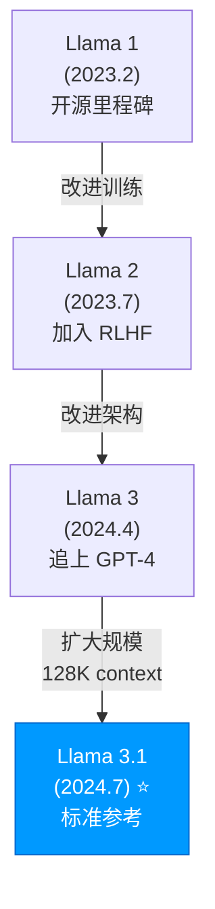

# 📖 Llama 3.1: 开源最成熟的基础模型

## 1. 🧬 演进定位 (The Lineage)

> [!SUMMARY] 身份卡片
>
> - **前身**：Llama 3（2024.4）- 第一个与 GPT-4 竞争的开源模型
> - **进化**：从"不错的开源基座"到"正式与闭源竞争的标准参考"
> - **竞品**：Llama 与所有开源模型（Mistral, Qwen, Llama 自己的微调版本）
> - **历史地位**：**开源 AI 的"iOS"—— 最成熟、最易集成、社区最大**

### 族谱树



---

## 2. 🧠 核心突变 (Key Innovations)

### 突破 1：更聪慧的 Scaling 策略

**问题**：之前的大模型通常用"少量高质量数据"

```
GPT-3：300B tokens 训练数据
GPT-4：未公开（估测 500B-2T）

成本很高（需要精心策划数据）
```

**Llama 3 的方法**：
```
使用 15.6T tokens（1500 亿个 tokens）

但不是"随便的互联网数据"
而是"经过精心筛选和去重"

策略：
  1. 收集大量原始数据
  2. 用质量评分模型筛选
  3. 删除重复数据（同样信息只保留一次）
  4. 优先级排序（高质量数据多次使用）
```

**实际效果**：
```
用更多的"足够好"的数据，比用"完美但稀少"的数据效果更好

这对开源很有利：
  - 开源社区有海量互联网数据
  - 不需要专有数据源
  - 可以用公开的质量评分方法
```

---

### 突破 2：405B 超大规模的稳定训练

**挑战**：405B 参数的模型非常难训练

```
问题 1：显存爆炸
  405B 模型权重 = 405 × 10^9 × 2 bytes = 810 GB
  需要 ~100 张 H100（$2000万+ 的 GPU）

问题 2：训练不稳定
  参数太多 → 梯度爆炸或消失
  需要极其精心的初始化和学习率调度

问题 3：训练时间太长
  15.6T tokens ÷ 1M tokens/秒 = 180 天
  硬件故障风险极大
```

**Meta 的解决方案**（推测）：
```
1. 分布式训练技术
   - Tensor Parallelism：把一个矩阵乘法分到多个 GPU
   - Pipeline Parallelism：把层分到不同的 GPU
   - Data Parallelism：不同 batch 在不同 GPU

2. 混合精度训练
   - 前向传播：用 FP8（8 位浮点）节省显存
   - 梯度计算：用 BF16（16 位浮点）保证精度

3. 智能的学习率调度
   - 初期（第 0-50 天）：学习率从小逐步增大
   - 中期（第 50-100 天）：保持高学习率
   - 末期（第 100-180 天）：逐步衰减学习率

4. 容错机制
   - 定期保存 checkpoint
   - GPU 故障自动转移
```

**成果**：
```
Llama 3.1 405B：
  ✓ 成功训练完成（这本身是成就）
  ✓ 性能达到与 GPT-4 相近的水平
  ✓ 开源发布（允许学术和商业使用）
```

---

### 突破 3：128K Context 的原生支持

**技术**：RoPE (Rotary Position Embeddings) 的改进

```
原始 Llama 3（4K context）：
  位置编码最大值 = 4096
  如果超过，性能下降

Llama 3.1（128K context）：
  使用 "Dynamic RoPE"
  位置编码可以动态扩展到任意长度
```

**数学原理**：

位置编码公式（标准 RoPE）：
$$PE(m) = e^{i m \theta_d}, \quad \theta_d = 10000^{-2d/d_{model}}$$

Dynamic RoPE 的改进：
```
而不是固定的 10000，使用：
  base = 10000^{(2k-1)/(2k)} 其中 k 根据 context 长度动态调整

结果：
  - 可以支持更长的序列
  - 性能不下降
  - 甚至可以"泛化"到训练时未见过的长度
```

**实际影响**：
```
128K tokens ≈ 96,000 字（中文）或 90,000 字（英文）

可以在一个 context 中放入：
  ✓ 一部中篇小说
  ✓ 一个完整的代码项目（数千行）
  ✓ 一份 100 页的法律文件
  ✓ 整个学术论文（含参考文献）
```

---

## 3. 📊 能力雷达 (Capability Radar)

### 按模型大小分类

#### Llama 3.1 8B（轻量）
```
        指令理解
            ⭐⭐⭐⭐☆
           /           \
      速度            代码
     ⭐⭐⭐⭐⭐        ⭐⭐⭐⭐
      /                  \
  能耗低              推理
 ⭐⭐⭐⭐⭐           ⭐⭐⭐
      \                  /
      通用理解         知识面
     ⭐⭐⭐⭐          ⭐⭐⭐⭐
           \           /
         成本效率
         ⭐⭐⭐⭐⭐
```

#### Llama 3.1 70B（中量）
```
        指令理解
            ⭐⭐⭐⭐⭐
           /           \
      速度            代码
     ⭐⭐⭐⭐         ⭐⭐⭐⭐⭐
      /                  \
  显存需求              推理
 ⭐⭐⭐               ⭐⭐⭐⭐
      \                  /
      通用理解         知识面
     ⭐⭐⭐⭐⭐         ⭐⭐⭐⭐⭐
           \           /
         性价比
         ⭐⭐⭐⭐⭐
```

#### Llama 3.1 405B（大型）
```
        指令理解
            ⭐⭐⭐⭐⭐
           /           \
      速度            代码
     ⭐⭐⭐            ⭐⭐⭐⭐⭐
      /                  \
  显存需求              推理
 ⭐☆☆               ⭐⭐⭐⭐☆
      \                  /
      通用理解         知识面
     ⭐⭐⭐⭐⭐         ⭐⭐⭐⭐⭐
           \           /
         通用性能
         ⭐⭐⭐⭐⭐
```

### 详细评分对比

| 维度 | 8B | 70B | 405B | vs GPT-4o |
|------|-----|-----|------|----------|
| **通用理解** | ⭐⭐⭐⭐ | ⭐⭐⭐⭐⭐ | ⭐⭐⭐⭐⭐ | 405B ≈ |
| **代码生成** | ⭐⭐⭐⭐ | ⭐⭐⭐⭐⭐ | ⭐⭐⭐⭐⭐ | 405B ≈ |
| **数学推理** | ⭐⭐⭐ | ⭐⭐⭐⭐ | ⭐⭐⭐⭐ | 略低 |
| **多语言** | ⭐⭐⭐⭐ | ⭐⭐⭐⭐☆ | ⭐⭐⭐⭐⭐ | 接近 |
| **长文本** | ⭐⭐⭐⭐ | ⭐⭐⭐⭐☆ | ⭐⭐⭐⭐⭐ | 略好 |
| **推理深度** | ⭐⭐ | ⭐⭐⭐ | ⭐⭐⭐ | << o1 |
| **速度** | ⭐⭐⭐⭐⭐ | ⭐⭐⭐ | ⭐⭐ | 快 vs 强 |

---

## 4. 💬 深度启示

### 洞察 1：开源模型的"够好就行"哲学

```
为什么 Llama 3.1 405B 重要？

不是因为：它比 GPT-4o 更强
（它略弱一些）

而是因为：它 "足够强" + "完全开源"

这打破了一个假设：
  "如果你想用最强的模型，你必须依赖 OpenAI"

现实：
  405B 能做 95% 的 GPT-4o 能做的事
  而且你可以：
    ✓ 自己部署（隐私）
    ✓ 自己微调（定制）
    ✓ 自己研究（开源）
    ✓ 不付月费（一次性买 GPU）
```

**长期影响**：
```
如果你是企业：
  2023："我们必须用 OpenAI API"
  2024："我们可以选择自建 Llama + OpenAI API 混合"
  2025："我们应该混合多个开源模型"

企业的议价权大幅增加
```

---

### 洞察 2：三个不同大小的模型满足不同需求

```
Llama 生态的妙处：同一家族，不同大小

Llama 3.1 8B：
  手机 APP、实时翻译、边缘设备
  ~ 最接近"为所有人赋能"的目标

Llama 3.1 70B：
  企业应用、本地部署、最优 ROI
  ~ 最平衡的选择

Llama 3.1 405B：
  研究、创意应用、不差钱的团队
  ~ 最强的开源选项

这与 "一个 GPT-4o 吃遍天下" 的策略截然不同
```

**商业启示**：
```
闭源模型（OpenAI）：
  一个尺寸，所有人
  高价格以覆盖所有用户

开源模型（Meta）：
  多个尺寸，各取所需
  初始成本高，但边际成本为零
```

---

### 洞察 3：数据质量比参数量更重要

```
Llama 3.1 的成功证明：

关键不是"参数越多越好"
而是"高质量数据"

对比：
  GPT-4：推测 1T+ 参数，但数据精选
  Llama 3.1：405B 参数，但 15.6T 高质量数据

  结果：性能竞争力接近！

启示：
  聪慧的数据处理 ≥ 简单的参数堆积
```

---

## 5. 💰 成本分析与部署

### 部署方式对比

| 方式 | 初期投入 | 月运维 | 总年成本 | 应用场景 |
|------|--------|--------|----------|---------|
| **API（如 Together）** | $0 | $1K-10K | $12K-120K | 初创、按需付费 |
| **本地 70B（单 GPU）** | $40K | $3K | $76K | 中等规模应用 |
| **本地 405B（多 GPU）** | $400K+ | $20K+ | $640K+ | 大企业、研究 |
| **微调 + 部署** | $50K+ | $5K+ | $110K+ | 定制应用 |

### 选择建议

```
✅ 用 Llama 8B：
  - 部署在移动设备
  - 实时性要求高（毫秒级延迟）
  - 成本极其敏感（边缘计算）

✅ 用 Llama 70B：
  - 企业内部应用（成本 vs 质量平衡）
  - 需要定制化（可以微调）
  - 隐私要求高（完全自主部署）
  - 初创公司的标准选择

✅ 用 Llama 405B：
  - 研究和开发（需要最强的开源）
  - 不缺钱的公司（GPU 成本不是瓶颈）
  - 需要与 GPT-4o 竞争（性能关键）

❌ 用 Llama 如果：
  - 需要多模态（图片、音频）→ 用 GPT-4o
  - 需要深度推理 → 用 o1 或 R1
  - 需要真实时间推理 → 用轻量模型或 Llama 8B
```

---

## 6. ⚠️ 关键限制

### 限制 1：没有多模态

```
Llama 3.1：纯文本模型
  ✗ 无法输入图片
  ✗ 无法输入音频
  ✗ 无法输入视频

影响：
  可以描述图片让 Llama 分析
  但无法直接上传图片并让其理解

解决方案：
  1. 用 Vision 模型（如 Llava）做图片编码
  2. 再把编码结果给 Llama
  3. 但这样整体延迟和成本都高
```

---

### 限制 2：推理能力有上限

```
Llama 3.1 vs o1 对比（数学竞赛）：
  Llama：AIME 33% （还不错）
  o1：AIME 83% （天壤之别）

原因：
  Llama：快速推理
  o1：深度思考（50+ 步）

对于需要复杂推理的任务，Llama 有天花板
```

---

### 限制 3：社区与生态的发展依赖

```
Llama 的优势：社区活跃

但也有风险：
  - 依赖社区维护（不是 Meta 官方）
  - 微调、量化、优化版本众多，难以选择
  - 某些问题可能只有社区能解决
```

---

## 7. 🔗 知识连接

### 核心技术

- **[[RoPE_Position_Encoding]]** - 位置编码的改进
- **[[Dynamic_Context_Extension]]** - 如何支持更长文本
- **[[Data_Curation_for_LLMs]]** - 高质量数据的重要性
- **[[Distributed_Training]]** - 超大规模模型的训练技术

### 微调与应用

- **[[Parameter_Efficient_Fine_Tuning]]** - LoRA 等方法
- **[[Llama_Ecosystem]]** - Code Llama, Llama-Chat 等衍生
- **[[Quantization_Methods]]** - 模型量化（4-bit 等）

### 竞争模型

- **[[Llama_vs_Mistral.md]]** - 开源竞争对手对比
- **[[Llama_vs_Qwen.md]]** - vs 中国开源模型
- **[[Llama_vs_GPT4o.md]]** - vs 闭源最强

---

## 8. 📊 为什么选 Llama 3.1

### ✅ 什么时候选 Llama

```
强烈推荐：

1. 开源优先的公司
   - 想要完全控制
   - 不想依赖商业 API

2. 大规模部署
   - 每月处理数十亿请求
   - API 成本会破产
   - 需要自建基础设施

3. 需要定制化
   - 垂直行业（医疗、法律）
   - 需要微调或蒸馏
   - 隐私敏感

4. 研究和实验
   - 学术研究
   - 模型改进研究
   - 新架构探索
```

### ❌ 什么时候不选 Llama

```
不适合：

1. 快速原型（MVP）
   成本：自建 infrastructure 花时间
   建议：用 API（DeepSeek 或 GPT-4o）

2. 小初创，人力有限
   成本：需要 MLOps 人员维护
   建议：用托管 API

3. 需要多模态
   限制：Llama 纯文本
   建议：用 GPT-4o

4. 需要最强推理
   限制：Llama 推理能力一般
   建议：用 o1 或 DeepSeek-R1
```

---

## 总结

### Llama 3.1 的历史意义

```
Llama 系列的演进：

Llama 1（2023.2）：证明了开源模型可行
  → "开源也有机会"

Llama 2（2023.7）：商业友好的许可证
  → "开源也可以赚钱"

Llama 3（2024.4）：性能与闭源竞争
  → "开源与闭源实力对等"

Llama 3.1（2024.7）：三个尺寸 + 长 context
  → "开源生态已成熟"
```

### 对开源 AI 的意义

```
Llama 3.1 = 开源 AI 的"基础设施"

就像：
  Linux = 开源软件的基础设施（操作系统）
  Llama = 开源 AI 的基础设施（基础模型）

所有其他开源 AI 都可以基于 Llama 构建：
  - 微调版本（数千个）
  - 量化版本（多种精度）
  - 应用层工具（RAG、Agent 等）
  - 领域特化模型（医疗、法律等）
```

### 2025 年的预测

```
短期：
  - Llama 3.2+ 发布（可能加入多模态）
  - 更多企业切换到 Llama（成本压力）
  - 社区贡献加速

中期：
  - Llama 成为"事实标准"（如 Linux）
  - 围绕 Llama 的商业生态繁荣
  - 云厂商都会提供 Llama 部署方案

长期：
  - Llama 可能被新的开源模型超越
  - 但其生态地位难以撼动
  - 类似 Linux 的不可替代性
```

---

**最后的话**：

Llama 3.1 是开源 AI 来之不易的胜利。

它证明了：
- 🏆 性能不再是闭源的专利
- 💰 成本可以极大降低
- 🔐 隐私和控制权回到用户手中
- 🌍 全球都可以使用和改进

2025 年，我预计 Llama（及其衍生）会成为**全球最广泛使用的基础模型**，超过所有闭源竞品的总和。
