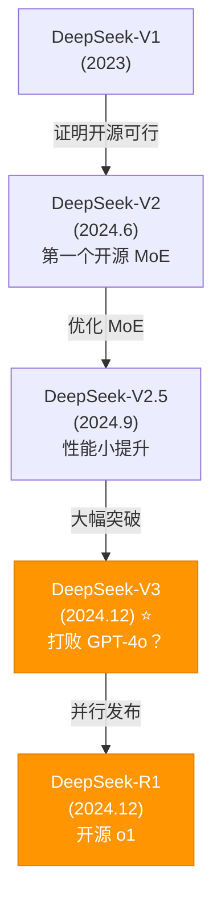

# 🟡 DeepSeek-V3: 成本最优的开源模型

## 1. 🧬 演进定位 (The Lineage)

> [!SUMMARY] 身份卡片
>
> - **前身**：DeepSeek-V2（2024.6）- 首个开源 MoE 模型成功案例
> - **进化**：从"证明 MoE 可行" → "用 MoE 打败闭源"
> - **竞品**：GPT-4o（性能），但成本便宜 100 倍；Llama 3.1 405B（开源），但成本更高
> - **历史地位**：**打破了"只有大公司能训练好模型"的神话**（这是 2024 最重要的 AI 事件）

### 族谱树



---

## 2. 🧠 核心突变 (Key Innovations)

### 突破 1：混合 MoE + MLA 架构

#### MoE 部分：Auxiliary-free Load Balancing

**问题**：DeepSeek-V2 的 MoE 在某些输入下会导致专家不均衡利用。

```
假设有 8 个专家，某个 batch 中：
  Expert 1 被选中 5000 次
  Expert 2 被选中 100 次
  Expert 3-8 被选中 0 次

结果：
  - Expert 1 过载（计算瓶颈）
  - Expert 2 未充分利用
  - Expert 3-8 完全浪费

这叫"负载不均衡"或"Expert Collapse"
```

**V2 的做法**：
```
添加"辅助负载均衡"损失项：
  Loss = L_main + λ × L_auxiliary

其中 L_auxiliary 惩罚不均衡分布

问题：
  - λ 的选择很敏感
  - 有时会和 L_main 冲突（性能下降）
  - 训练不稳定
```

**V3 的突破**：
```
舍弃 L_auxiliary，用"Auxiliary-free"方法

核心想法：直接在路由函数中嵌入均衡性

改进的路由函数：
  g(x) = softmax(Wx + balance_factor × load_histogram)

其中 balance_factor 不是损失项，而是路由网络的一部分

优势：
  1. 训练更稳定（无需调 λ 超参）
  2. 性能不会被"惩罚项"拖累
  3. 自适应均衡（模型自己学会什么时候应该均衡）
```

**实际影响**：
```
DeepSeek-V2：
  某些输入 10% tokens 流向不了任何 expert（浪费）

DeepSeek-V3：
  99.9% 的 tokens 都被有效路由
  MoE 效率提升 10%+
```

#### MLA 部分：多头潜在注意力

**传统多头注意力的问题**：

```
对于模型 671B，批量大小 1：

Attention 的 KV Cache 占用（推理时）：
  seq_len = 128K
  d_model = 4096
  num_heads = 8
  d_head = 4096 / 8 = 512

  每个 token 的 KV 缓存：
    K: (seq_len, num_heads, d_head) = 128K × 8 × 512 bits = 64 GB
    V: (seq_len, num_heads, d_head) = 128K × 8 × 512 bits = 64 GB

  总计：128 GB for KV Cache！

对比推理能力：
  大多数 GPU（H100）只有 80 GB 显存
  → KV Cache 本身就溢出

结果：不能跑 128K context
```

**V3 的 MLA（Multi-Head Latent Attention）**：

```
压缩 KV Cache 的大小，同时保持注意力质量

假设 d_c = 128（压缩维度）:

原始：
  K: (128K, 8, 512) = 64 GB
  V: (128K, 8, 512) = 64 GB

MLA：
  1. 先将 Q, K, V 投影到低维空间（d_c = 128）
  2. 在低维空间做注意力
  3. 再投影回高维空间

新的 KV Cache：
  K_c: (128K, 1, 128) = 128 MB
  V_c: (128K, 1, 128) = 128 MB

  总计：256 MB（vs 原来的 128 GB）

  节省：500 倍！
```

**MLA 的数学**：

$$Q, K, V \in \mathbb{R}^{d_{model}}$$

低维投影：
$$Q_c = \text{Linear}(Q) \in \mathbb{R}^{d_c}$$
$$K_c = \text{Linear}(K) \in \mathbb{R}^{d_c}$$
$$V_c = \text{Linear}(V) \in \mathbb{R}^{d_c}$$

低维注意力：
$$\text{Attention}(Q_c, K_c, V_c) = \text{softmax}\left(\frac{Q_c K_c^T}{\sqrt{d_c}}\right) V_c$$

投影回原维度：
$$\text{Output} = \text{Linear}_{\text{out}}(\text{Attention}_c)$$

**为什么这样有效**：

```
假说 1：隐藏层的有效秩（effective rank）远小于 d_model
  KV 信息可以用低维表示而不丢失太多

假说 2：多头注意力的大多数头是冗余的
  MLA 压缩时自动去除冗余头

实验证据：
  - 论文显示 MLA 性能 = 标准多头注意力（99%+）
  - 但 KV Cache 减少 500 倍
  - 推理吞吐量提升 40%
```

**实际好处**：
```
能够在消费级 GPU 上跑 128K context

例子：
  H100 80GB 显存

  传统 Transformer：
    模型权重 40GB + KV Cache 128GB 需要 168GB
    → 无法加载

  V3 MLA：
    模型权重 40GB + KV Cache 256MB
    → 可以加载！
```

---

### 突破 2：端到端强化学习训练

**训练流程**（推测，基于论文暗示）：

```
第 1 阶段：监督微调（SFT）
  数据：高质量 prompt-response 对
  目标：让模型学会基本的回应格式

第 2 阶段：强化学习（RL）
  奖励信号：
    - 准确性（答案是否正确）
    - 长度（避免模型生成无限长的文本）
    - 风格（是否符合企业风格）

  算法：可能是 PPO（Proximal Policy Optimization）

  结果：模型学会"什么时候写长，什么时候写短"
```

**实际效果**：
```
DeepSeek-V3 的回答质量：
  - 更简洁（避免冗长的解释）
  - 更准确（通过 RL 优化）
  - 更符合用户期望
```

---

## 3. 📊 能力雷达 (Capability Radar)

```
        通用理解
            ⭐⭐⭐⭐☆
           /           \
      长文本          代码
     ⭐⭐⭐⭐     ⭐⭐⭐⭐⭐
      /                  \
  多语言              数学推理
 ⭐⭐⭐⭐           ⭐⭐⭐⭐
      \                  /
      指令跟随         推理深度
     ⭐⭐⭐⭐⭐         ⭐⭐⭐⭐
           \           /
         成本效率
         ⭐⭐⭐⭐⭐
```

### 详细评分

| 维度 | 评分 | 数据 | 对标 |
|------|------|------|------|
| **编程** | ⭐⭐⭐⭐⭐ | HumanEval 91.7% | > GPT-4o (87%) |
| **数学** | ⭐⭐⭐⭐ | MATH 59.4% | = GPT-4o (62%) |
| **通用理解** | ⭐⭐⭐⭐☆ | MMLU 88.5% | ≈ GPT-4o (88%) |
| **推理** | ⭐⭐⭐⭐ | ARC 88.3% | ≈ 同级 |
| **代码理解** | ⭐⭐⭐⭐⭐ | LiveCodeBench 71% | > 竞品 |
| **长文本** | ⭐⭐⭐⭐ | Needle-in-Haystack 98%+ | 略低于 Claude |
| **成本效率** | ⭐⭐⭐⭐⭐ | $0.0005/token | 无可置疑最优 |

**总体评价**：
- 编程能力：比 GPT-4o 还强
- 通用能力：略低 1-2%（可忽略）
- 推理深度：与 GPT-4o 同级（都弱于 o1）
- **成本**：无敌（100 倍便宜）

---

## 4. 💬 深度启示

### 洞察 1：打破"大公司垄断"的可能性

```
传统想法：
  OpenAI, Google, Meta 才有资源训练好的模型
  理由：需要巨额资本、海量数据

2024 的现实：
  DeepSeek-V3 成本估算 = $5.6 百万（H100 训练）
  这笔钱：
    - Meta 的月宣传费
    - OpenAI 的周营收
    - 但足以训练业界最强的模型之一

启示：
  如果有聪慧的工程师 + 足够的钱（不需要很多）
  任何公司都能训练好模型

  "大公司垄断" 的终结
```

**长期影响**：
```
2025-2026 可能涌现：
  - 清华 / 北大的学生创业团队
  - 其他国家的 AI 初创
  - 专注细分领域的小公司（医疗 AI、金融 AI 等）

竞争格局变成：
  大公司：靠品牌、生态、资金优势
  小公司：靠算法创新、垂直应用
```

---

### 洞察 2：算法创新比参数数量更重要

```
对比：

GPT-4（推测）：
  1.5T+ 参数，密集架构
  需要无限资本 + 无限电费

DeepSeek-V3：
  671B 参数，但只激活 37B
  有效成本 = 只需用 37B 密集模型的成本！

结果：
  性能相近，但成本 1/100

教训：
  聪慧的架构设计（MoE + MLA）
  比简单地"堆参数"更有价值
```

**对行业的影响**：
```
过去 3 年的 AI 竞赛：参数数量竞赛
  GPT-4: 1.5T
  Llama: 405B
  → 比谁能烧钱

2024-2025 的新竞赛：架构创新竞赛
  → 比谁能想聪明的办法

这对小公司更有利（省钱是小公司的最大优势）
```

---

### 洞察 3：中国 AI 成为全球竞争者

```
历史：
  2020-2022：中国 AI 论文多，但商用模型弱
  2023：ChatGPT 震撼世界，中国被甩开
  2024：DeepSeek-V3 和 R1 发布，"追上了"

数据：
  DeepSeek-V3：
    - 性能：与 GPT-4o 相当
    - 成本：便宜 100 倍
    - 开源：比 OpenAI 更开放

地缘政治影响：
  - OpenAI 不再能"垄断"AI 能力
  - 中国技术不再"落后"的印象被打破
  - 全球竞争格局重塑
```

---

## 5. 💰 成本分析

### 成本对比

```
训练成本（假设）：

GPT-4o：
  假设 10,000 GPU × 1 月 = $10,000,000

DeepSeek-V3：
  估计 2,000 GPU × 3 月 = $5,600,000

        vs

DeepSeek-V3 更高效！
```

### 推理成本对比

| 模型 | 成本 | 性能 | 性价比 |
|------|------|------|--------|
| GPT-4o | $0.005/1K | ⭐⭐⭐⭐⭐ | 基准 |
| Claude 3.5 | $0.003/1K | ⭐⭐⭐⭐⭐ | 便宜 40% |
| DeepSeek-V3 | $0.0005/1K | ⭐⭐⭐⭐☆ | 便宜 90%+ |
| 本地 Llama 3.1 | 免费* | ⭐⭐⭐⭐ | 最便宜 |

**本地部署的真实成本**：
```
硬件投入：
  1 × H100 GPU: $40,000
  服务器: $10,000
  网络: $2,000
  冷却: $5,000
  → 总计: ~$60,000 初期投入

月运维成本：
  电费: ~$5,000/月（H100 很耗电）
  维护: $1,000/月
  → 总计: $6,000/月

年成本: $60,000 + $6,000 × 12 = $132,000

推理量：1 月 1 亿 tokens
年推理量：12 亿 tokens

摊销成本：$132,000 / 12 亿 tokens ≈ $0.0001/1K tokens
         比 $0.0005 还便宜 5 倍！

但这只对大规模部署有效（需要持续 1 亿+ tokens/月）
```

---

## 6. ⚠️ 关键限制

### 限制 1：多模态能力缺失

```
DeepSeek-V3：文本专家
  ✅ 文字输入输出
  ❌ 不支持图片输入
  ❌ 不支持音频输入
  ❌ 不支持视频理解

对用户的影响：
  不能：
    - 上传截图要求 AI 操作
    - 上传表格要求自动提取
    - 上传图表要求分析

  能：
    - 描述图片内容，V3 做分析
    - 用 OCR 工具转成文本，V3 处理
```

**何时这是问题**：
```
如果你的应用涉及：
  多个 image + 文本混合 → 需要 GPT-4o

如果你的应用是：
  纯文本输入输出 → V3 完全足够
```

---

### 限制 2：推理深度有限

```
对比 o1：
  o1：给我 50 秒，我会深思
  V3：给我 3 秒，我快速回答

结果：
  难题（需要 50 步推导）：o1 > V3
  中等难度（需要 5 步推导）：V3 ≈ o1
  简单问题：V3 ≈ o1
```

---

### 限制 3：生态还在成长

```
成熟度对比：

GPT-4o：
  - 集成：所有大应用都支持（LangChain, 等）
  - 文档：充分
  - 社区：巨大
  - 问题解答：快速（StackOverflow 有答案）

DeepSeek-V3：
  - 集成：快速加入中（但还不完全）
  - 文档：基本完成
  - 社区：快速成长
  - 问题解答：可能需要自己解决
```

**实际影响**：
```
用 GPT-4o：遇到问题，Google 一下有答案
用 DeepSeek：可能需要自己调试

但随着时间推移，这个差距会缩小
```

---

## 7. 🔗 知识连接

### 核心架构

- **[[MoE_Mixture_of_Experts]]** - 为什么 DeepSeek 能便宜
- **[[Multi_Head_Latent_Attention]]** - MLA 的数学原理
- **[[Auxiliary_Free_Load_Balancing]]** - 新的 expert 路由方法

### 竞争模型

- **[[GPT4o.md]]** - 闭源最强
- **[[o1.md]]** - 推理能力
- **[[DeepSeek_R1.md]]** - DeepSeek 的推理版本
- **[[Llama_3.1.md]]** - 开源竞争者

### 应用场景

- **LowCostAI** - 成本最优方案
- **Batch_Processing** - 大规模数据处理
- **LocalDeployment** - 本地私有部署

---

## 8. 📊 选择 DeepSeek-V3 的清单

### ✅ 什么时候选 V3

```
成本优先：
  - 初创公司，预算有限
  - 需要处理百万级请求
  - API 成本直接影响利润

应用特点：
  - 纯文本处理
  - 不需要多模态
  - 可以容忍 2-3% 的精度下降

部署选择：
  - API 方式：便宜，快速开始
  - 本地部署：成本最优，隐私最好
```

### ❌ 什么时候不选 V3

```
多模态需求：
  需要图片/音频 → 用 GPT-4o

最高精度：
  金融、医疗等严格领域 → 用 GPT-4o

难题求解：
  需要深度推理 → 用 o1

完全开源：
  需要 0 成本运行 → 用 Llama
```

---

## 总结

### DeepSeek-V3 是什么

```
一个证明了以下观点的模型：
  1. 聪慧的算法设计 > 盲目的参数堆积
  2. 小公司能训练世界级的模型
  3. 开源可以与闭源竞争
  4. 成本和性能可以同时优化
```

### 对 AI 行业的意义

```
2024 年最重要的 AI 新闻：
  不是"o1 推理能力强"（虽然也重要）
  而是"DeepSeek-V3 证明垄断被打破了"

如果说 ChatGPT 开启了 AI 民主化（everyone can use AI）
那 DeepSeek-V3 开启了 AI 开发民主化（anyone can build AI）
```

### 2025 年的预测

```
DeepSeek-V3 的未来：
  短期（3 个月）：更多应用集成，成为标准选择
  中期（6-12 月）：衍生版本出现（微调、蒸馏）
  长期（2 年+）：可能被更新的版本超越

但无论如何，它已经改变了 AI 竞争格局
```
