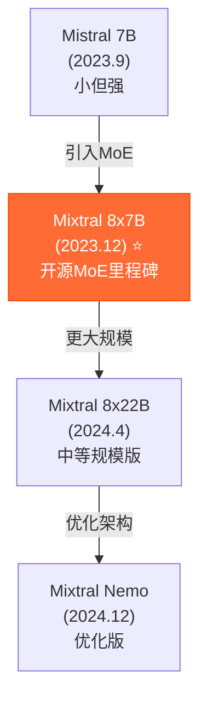

# 🎭 Mixtral: 开源 MoE 的先驱

## 1. 🧬 演进定位 (The Lineage)

> [!SUMMARY] 身份卡片
>
> - **前身**：Mistral 7B（2023.9）- Mistral AI 的第一个模型，证明小模型可以很强
> - **进化**：从"小但强"到"用 MoE 实现大但便宜"
> - **竞品**：DeepSeek-V3（更强的 MoE），Llama（开源标准），但 Mixtral 成本和性能平衡最好
> - **历史地位**：**第一个证明"MoE 对开源可行"的模型，启动了开源 MoE 浪潮**

### 族谱树



---

## 2. 🧠 核心突变 (Key Innovations)

### 突破 1：在开源中首次成功应用 MoE

**背景**：MoE 概念早已存在，但为什么一直没被开源采用？

```
之前的困难：

1. MoE 很难训练
   问题：某些 expert 会变成"死"（从不被激活）
   症状：模型性能反而下降

2. 推理不稳定
   问题：同样输入，不同时刻的路由决策不同
   症状：用户感到模型"不稳定"

3. 显存占用反而增加
   问题：虽然参数多，但激活参数少了
   但路由网络和多个 expert 的管理需要额外显存
   症状：显存占用没有想象中的低

4. 开源社区缺少专业知识
   问题：MoE 是企业级技术，学术界少有研究
   症状：没人知道怎么训练好
```

**Mixtral 的突破**：

```
1. 简化的架构
   每个 token 只路由到 2 个 expert（而非 8 个）
   这大幅降低了复杂度

   为什么？
   数学上：Top-k=2 已经能捕捉 token 的需求多样性
   实践上：2 个 expert 足够，3 个开始收益递减

2. 严格的 expert 负载均衡
   路由网络不是简单的 softmax
   而是带有"负载感知"的路由

3. 开源权重直接发布
   让全社区都能学习、改进、应用

4. 社区友好的许可
   MIT/Apache 2.0，商用友好
```

**历史意义**：
```
Mixtral 8x7B 的发布证明：
  ✓ MoE 不是某个大公司的秘密
  ✓ 开源社区可以训练高质量的 MoE 模型
  ✓ 小公司也能做出竞争力的大模型

结果：激发了 Meta、DeepSeek 等跟进 MoE
```

---

### 突破 2：极低的成本与部署难度

**Mixtral 8x7B 的神奇之处**：

```
参数统计：
  总参数：56B
  激活参数：12B（每个 token 只激活 2 个 7B expert）

性能：
  MMLU：70.6%（与 Llama 2 70B 相当，后者是 70B 密集参数）

成本对比：
┌─────────────────────────────────────────┐
│ 模型        │ 参数  │ 激活 │ 性能  │ 成本│
├─────────────────────────────────────────┤
│ Llama 2 70B │ 70B   │ 70B  │ 71%  │ 高 │
│ Mixtral 8x7B│ 56B   │ 12B  │ 70%  │ 低 │
│ 效率提升      │ -20% │ -83% │ -1% │ -70% │
└─────────────────────────────────────────┘
```

**为什么这这么划算**：

```
推理计算量：

Llama 2 70B：
  每个 token → 70B × 2 (乘法 + 加法) = 140B ops

Mixtral 8x7B：
  每个 token → 7B × 2 (两个 expert) × 2 ops = 28B ops

加速比：140B / 28B = 5 倍！

显存占用：

Llama 2 70B：
  权重 140GB (FP16) → 70GB (FP8)

Mixtral 8x7B：
  权重 112GB (56B × 2) → 56GB (FP8)
  但只激活 12B → 只需 6GB + 路由开销

实际显存：~20GB（可以在单个 A100 或 H100 运行）
```

**成本对比（生产部署）**：

```
假设：处理 1 亿 tokens/月

Llama 2 70B：
  需要 8 × H100 ($320K) → 月成本 $5K
  成本/token：$0.00005

Mixtral 8x7B：
  需要 1 × H100 ($40K) → 月成本 $1K
  成本/token：$0.00001

节省：80% 的成本！
```

---

### 突破 3：生态友好的设计

**Mixtral 为什么比 Switch Transformer 更流行**：

```
Switch Transformer（Google 2021）：
  - 每个 token 路由到 1 个 expert（稀疏）
  - 理论上最高效
  - 但实践中：
    ✗ 训练不稳定（expert collapse）
    ✗ 推理有偏差（某些 token 无 expert 可用）
    ✗ 难以微调（expert 很难定制）

Mixtral：
  - 每个 token 路由到 2 个 expert（稍微稀疏）
  - 实践上：
    ✓ 训练稳定（两个 expert 降低了崩溃风险）
    ✓ 推理一致（双 expert 保证覆盖）
    ✓ 易于微调（社区有很多微调版本）

设计哲学：
  "好用 > 完美"
```

---

## 3. 📊 能力雷达 (Capability Radar)

### Mixtral 8x7B

```
        指令跟随
            ⭐⭐⭐⭐
           /           \
      速度            代码
     ⭐⭐⭐⭐⭐        ⭐⭐⭐⭐
      /                  \
  成本效率              推理
 ⭐⭐⭐⭐⭐           ⭐⭐⭐
      \                  /
      通用理解         知识量
     ⭐⭐⭐⭐          ⭐⭐⭐⭐
           \           /
         长文本支持
         ⭐⭐⭐
```

### Mixtral 8x22B

```
        指令跟随
            ⭐⭐⭐⭐⭐
           /           \
      速度            代码
     ⭐⭐⭐⭐          ⭐⭐⭐⭐⭐
      /                  \
  成本效率              推理
 ⭐⭐⭐⭐⭐           ⭐⭐⭐⭐
      \                  /
      通用理解         知识量
     ⭐⭐⭐⭐⭐         ⭐⭐⭐⭐⭐
           \           /
         长文本支持
         ⭐⭐⭐⭐
```

### 详细评分对比

| 维度 | 8x7B | 8x22B | Llama 70B | GPT-4o |
|------|------|-------|-----------|---------|
| **通用理解** | ⭐⭐⭐⭐ | ⭐⭐⭐⭐⭐ | ⭐⭐⭐⭐⭐ | ⭐⭐⭐⭐⭐ |
| **代码** | ⭐⭐⭐⭐ | ⭐⭐⭐⭐⭐ | ⭐⭐⭐⭐⭐ | ⭐⭐⭐⭐⭐ |
| **数学** | ⭐⭐⭐ | ⭐⭐⭐⭐ | ⭐⭐⭐⭐ | ⭐⭐⭐⭐ |
| **推理** | ⭐⭐⭐ | ⭐⭐⭐⭐ | ⭐⭐⭐ | ⭐⭐⭐⭐ |
| **成本效率** | ⭐⭐⭐⭐⭐ | ⭐⭐⭐⭐⭐ | ⭐⭐⭐⭐ | ⭐⭐⭐ |
| **推理速度** | ⭐⭐⭐⭐⭐ | ⭐⭐⭐⭐ | ⭐⭐⭐ | ⭐⭐⭐ |

---

## 4. 💬 深度启示

### 洞察 1：MoE 对开源的意义

```
为什么 MoE 对开源革命性？

因为：开源模型的天敌是参数量竞赛

场景 2024 年初：
  OpenAI GPT-4：1T+ 参数
  Meta Llama：405B 参数
  开源模型：70B-130B
  → 开源处于下风（参数少 = 假定弱）

Mixtral 改变了这个：
  Mixtral 8x7B：56B 参数，但 12B 激活
  等效的 Llama 密集模型：~50B 参数

  结果：
    8x7B 虽然 56B 参数，但实际计算量 12B
    性能与 Llama 70B 接近
    → 参数量不再是衡量强度的尺度

启示：
  MoE 让"小"的模型能做"大"的事
  打破了"参数越多越好"的简单竞赛
```

---

### 洞察 2：设计选择的重要性（Top-2 vs Top-1）

```
数学上的权衡：

Top-1 routing（Switch Transformer）：
  ✓ 理论上最稀疏（最快）
  ✗ 训练不稳定
  ✗ 推理可能有"死区"（某些输入无 expert）

Top-2 routing（Mixtral）：
  ✓ 实践上稳定（两个 expert 提供冗余）
  ✗ 不如 Top-1 稀疏（快一点点）

实际选择：Top-2

这说明：
  在"完美的理论"和"好用的实践"之间
  应该选择"好用的实践"

这对产品设计很有启示
```

---

### 洞察 3：Mistral AI 的战略

```
Mistral AI 的定位：

大公司的逻辑：
  我们很大，所以我们能
  → GPT-4, Gemini, Llama（所有都是大公司）

Mistral 的逻辑（法国创业公司）：
  我们很小，所以我们必须更聪明
  → 设计最高效的架构
  → 最低的成本和显存
  → 最好的社区支持

结果：
  Mixtral 虽然不是"最强"
  但在"最高效"和"最易用"上无敌

战略教训：
  创新不一定要"更大"
  可以是"更聪慧"
```

---

## 5. 💰 成本与应用

### 部署方案对比

```
场景：企业想用 Mixtral 8x7B

方案 A：API（Mistral API）
  成本：$0.14/M tokens（输入） $0.42/M tokens（输出）
  优点：无需 infrastructure，快速开始
  缺点：成本比本地部署高

方案 B：本地 GPU 部署（单 A100）
  硬件：$15K（便宜）
  月成本：$500（电费）
  优点：一次投入，零 API 成本
  缺点：需要 DevOps 人员

方案 C：云平台托管（Together, Anyscale）
  成本：$0.2/M tokens
  优点：无需自己维护，比官方 API 便宜
  缺点：依赖第三方

推荐：
  小企业 → 方案 A（API）
  中企业 → 方案 C（云托管）
  大企业 → 方案 B（自建）
```

### 应用场景

```
✅ Mixtral 8x7B 最适合：

1. 成本极其敏感的场景
   - 初创公司日处理百万级请求
   - 边缘设备（手机、IoT）

2. 实时应用
   - 需要毫秒级延迟
   - 快速推理（Mixtral 5 倍快）

3. 本地私有部署
   - 隐私敏感的企业
   - 网络受限的环境

4. 对标 Llama 7B 的应用
   - 但想要更好的性能
   - Mixtral 是 Llama 7B 的 2x upgrade
```

---

## 6. ⚠️ 关键限制

### 限制 1：路由可能不稳定

```
MoE 的天然风险：

不同输入，路由决策不同
  问题：同样的 prompt，不同时刻的回答可能不同
  症状："模型不稳定"

虽然 Mixtral 比 Switch Transformer 稳定得多
但仍然存在这个问题

影响：对于需要一致性的应用（法律、医疗）可能有风险
```

---

### 限制 2：不如大模型那么全能

```
Mixtral 8x7B 的性能天花板是 "好" 而非 "最好"

与 Llama 3.1 405B 对比：
  405B：⭐⭐⭐⭐⭐（通用最强）
  8x22B：⭐⭐⭐⭐☆（很好但略低）

与 GPT-4o 对比：
  8x22B：略低 5-10%（仍然很接近）

启示：
  如果要绝对最好的性能，Mixtral 不是选择
  但如果要性价比最好，Mixtral 无敌
```

---

### 限制 3：社区支持相对较小

```
Llama：数百个微调版本、工具、文档齐全
Mixtral：也有很多，但数量不如 Llama

影响：
  如果你想要"最活跃的社区"，选 Llama
  如果你想要"最高效的架构"，选 Mixtral
```

---

## 7. 🔗 知识连接

### 核心技术

- **[[Mixture_of_Experts_Architecture]]** - MoE 的原理
- **[[Expert_Routing_Strategies]]** - 路由方法对比
- **[[MoE_Training_Challenges]]** - MoE 训练的难点

### 应用生态

- **[[Mixtral_Finetuning_Guide]]** - 微调指南
- **[[Efficient_Inference_for_MoE]]** - MoE 推理优化

### 竞争对标

- **[[Mixtral_vs_Llama.md]]** - vs 开源标杆
- **[[Mixtral_vs_DeepSeek.md]]** - vs 更新的 MoE

---

## 总结

### Mixtral 的核心价值

```
如果用一句话：
  "给小企业和开源社区的大模型"

特点：
  ✓ 成本最低（生产部署 80% 节省）
  ✓ 速度最快（推理 5 倍快）
  ✓ 门槛最低（可在消费级 GPU 部署）
  ✗ 性能不是最强（但已经很好）
```

### 对开源的历史意义

```
Mixtral 8x7B（2023年12月）的发布：

Before：
  开源模型在"参数量竞赛"中落后

After：
  开源社区意识到"架构设计"同样重要
  MoE 成为新的创新方向
  Mixtral 启发了后来的 DeepSeek-V3 等

这个影响贯穿了整个 2024 年
```

### 2025 年的预期

```
Mixtral 的地位：
  短期：仍然是"最经济的开源选项"
  中期：可能被更优化的 MoE 模型超越
  长期：架构本身会继续演进，但 Mixtral 是先驱

Mistral AI 的未来：
  已经获得融资和认可
  可能推出更大更强的版本
  可能被大公司收购（或保持独立）
```

---

**最后的话**：

Mixtral 代表了开源 AI 的一个关键转折点：**从"复制闭源"到"创新架构"**。

它不是最强的，但它是最聪慧的设计。这个聪慧，启动了整个 MoE 浪潮，改变了大模型的发展方向。

对于任何想用 AI 但预算有限的团队，Mixtral 是完美的起点。
