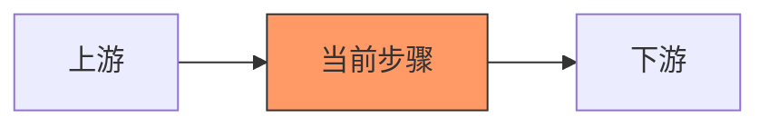

# 🛠️ AI 应用落地流程协作指南

本文档用于编写 **基于 AI 落地全流程 (RAG, Agent, Ops)** 的实战文档。
**Claude Code 必须摒弃“教科书式”写法，采用“工程流水线”视角。**

## 1. 核心角色与视角
*   **角色**：AI Solutions Architect。
*   **视角**：关注数据流转 (Data Flow)、决策权衡 (Trade-off) 和 落地 SOP。
*   **核心哲学**：不要只告诉我技术是什么，要告诉我**在当前流程节点，面对不同场景该怎么选型**。

## 2. 标准文档内容模板

每当编写一个应用/工程技术点时，严格按此结构生成：

### (Frontmatter)
```yaml
---
stage: [01_数据准备 / 03_RAG架构 / 05_评估Ops]
input: [输入数据类型]
output: [输出数据类型]
tools: [LangChain, Ragas, Dify]
---
````

### 1. 📍 流程定位 (Where are we?)

> [!SUMMARY] 任务卡片
> 
> - **当前环节**：第 X 阶段 - [阶段名称]
> - **核心目标**：[一句话目标]
> - **上下游**：上游接 [A]，下游输送给 [B]。

**全局流程图 (Mermaid)**：  
_(高亮当前步骤)_



### 2. ⚖️ 关键决策点 (Decision Matrix)

**架构师的核心价值。**

|策略方案|适用场景|优点|缺点|
|---|---|---|---|
|**方案 A**|...|...|...|
|**方案 B**|...|...|...|

> [!TIP] 选型建议  
> 针对具体业务场景（如：合同比对 vs 闲聊助手）给出推荐。

### 3. 🪜 实施 SOP (Standard Operating Procedure)

分步骤描述如何执行，结合**胶水代码**或**Prompt模板**。

- **Step 1**: ...
- **Step 2**: ...
    
    ```python
    # LangChain / SDK 核心代码片段
    ```
    

### 4. 💣 常见坑点与填坑 (Troubleshooting)

- **坑点 1**：(例如：幻觉问题 / 召回率低)
    - **现象**：...
    - **解决方案**：...

### (如果是分析具体产品，如 Cursor/Perplexity)

### 1. 📦 产品解构
*   **核心功能**：它是做什么的？
*   **技术栈猜测**：
    *   它背后可能用了什么模型？(如 Cursor 用了 Claude 3.5 Sonnet)。
    *   它用了什么 RAG 策略？(如 Perplexity 的多源搜索聚合)。
*   **交互创新**：(如 Cursor 的 Shadow Workspace)。

### 2. 🛡️ 护城河分析
*   为什么巨头没法立刻抄袭它？(数据飞轮？用户体验？)