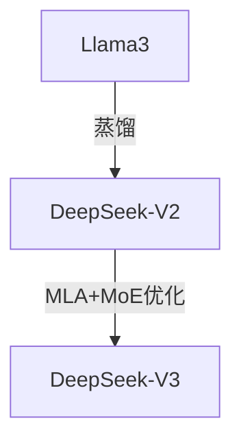

**核心目的**：搞懂模型之间的**继承、竞争和突变关系**。比如 DeepSeek V3 为什么强？它是怎么站在 Llama 的肩膀上结合 MoE 做出来的？

# 🧬 模型族谱与演进分析指南

本文档专用于编写 **具体大模型 (GPT-4, DeepSeek, Llama)** 的深度分析文档。
**Claude Code 必须采用“演进生物学”视角，分析模型的“基因突变”和“核心贡献”。**

## 标准内容模板

### (Frontmatter)
```yaml
---
model: [模型名称]
release_date: [发布时间]
params: [参数量, e.g. 671B (37B active)]
arch: [Dense / MoE / Hybrid]
context: [上下文长度]
---
````

### 1. 🧬 演进定位 (The Lineage)

> [!SUMMARY] 身份卡片
> 
> - **前身**：它基于什么架构？(例如：DeepSeek V3 基于 V2 的 MoE 架构改进)。
> - **竞品**：它主要对标谁？(例如：对标 GPT-4o 但成本仅为 1/10)。
> - **历史地位**：它在 AI 史上的里程碑意义是什么？

**族谱树 (Mermaid)**：  
_(展示它在技术树上的位置)_



### 2. 🧠 核心突变 (Key Innovations)

**它做对了什么？** (列出 3 个核心技术突破)

- **突破 1**：(例如：FP8 混合精度训练 - 解决了显存墙问题)。
- **突破 2**：(例如：MLA 注意力机制 - 压缩了 KV Cache)。
- **突破 3**：(例如：Auxiliary-free Load Balancing - 解决了 MoE 负载不均)。

### 3. 📊 能力雷达 (Capability Radar)

|维度|评分|评价|
|---|---|---|
|**代码能力**|⭐⭐⭐⭐⭐|接近 Claude 3.5 Sonnet 水平|
|**数学推理**|⭐⭐⭐⭐|强于 GPT-4，弱于 o1|
|**长文本**|⭐⭐⭐|128k 支持，但大海捞针略弱|

### 4. 💬 深度启示

- 这个模型告诉我们：堆算力不是唯一出路，算法优化（如 MoE）才是未来。